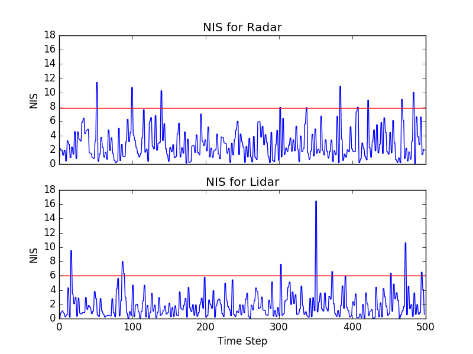

# Unscented Kalman Filter Project
Self-driving Car Nanodegree Project 2/Term 2 - Appplying a Unscented Kalman Filter to estimate the state of a moving object with noisy lidar and radar measurements. Passing the project requires obtaining RMSE values that are lower that the tolerance outlined in the [project rubric](https://review.udacity.com/#!/rubrics/783/view).

This project involves the Term 2 Simulator which can be downloaded [here](https://github.com/udacity/self-driving-car-sim/releases)

This repository includes two files that can be used to set up and install [uWebSocketIO](https://github.com/uWebSockets/uWebSockets) for either Linux or Mac systems. For windows you can use either Docker, VMware, or even [Windows 10 Bash on Ubuntu](https://www.howtogeek.com/249966/how-to-install-and-use-the-linux-bash-shell-on-windows-10/) to install uWebSocketIO. Please see [this concept in the classroom](https://classroom.udacity.com/nanodegrees/nd013/parts/40f38239-66b6-46ec-ae68-03afd8a601c8/modules/0949fca6-b379-42af-a919-ee50aa304e6a/lessons/f758c44c-5e40-4e01-93b5-1a82aa4e044f/concepts/16cf4a78-4fc7-49e1-8621-3450ca938b77) for the required version and installation scripts.

Once the install for uWebSocketIO is complete, the main program can be built and run by doing the following from the project top directory.

1. mkdir build
2. cd build
3. cmake ..
4. make
5. ./ExtendedKF

---

## Other Important Dependencies

* cmake >= 3.5
  * All OSes: [click here for installation instructions](https://cmake.org/install/)
* make >= 4.1 (Linux, Mac), 3.81 (Windows)
  * Linux: make is installed by default on most Linux distros
  * Mac: [install Xcode command line tools to get make](https://developer.apple.com/xcode/features/)
  * Windows: [Click here for installation instructions](http://gnuwin32.sourceforge.net/packages/make.htm)
* gcc/g++ >= 5.4
  * Linux: gcc / g++ is installed by default on most Linux distros
  * Mac: same deal as make - [install Xcode command line tools](https://developer.apple.com/xcode/features/)
  * Windows: recommend using [MinGW](http://www.mingw.org/)
  
---
## Results
  
For dataset 1, the final RMSE values for UKF and EKF are the following (the values of UKF's RMSE for each step are [here](src/RMSE.txt)). It's notable that specially for the velocities, the UKF performs better than the EKF:
  
|          |UKF      |EKF      |
|---       |---      |---      |
|RMSE (px) |0.0588   |0.0973   |
|RMSE (py) |0.0952   |0.0855   |
|RMSE (vx) |0.1526   |0.4513   |
|RMSE (vy) |0.1796   |0.4399   |

For the Normalized Innovation Squared (NIS), the values for the RADAR and LASER are plotted on the graphic below (the values of UKF's NIS for each step are [here](src/NIS.txt)):

